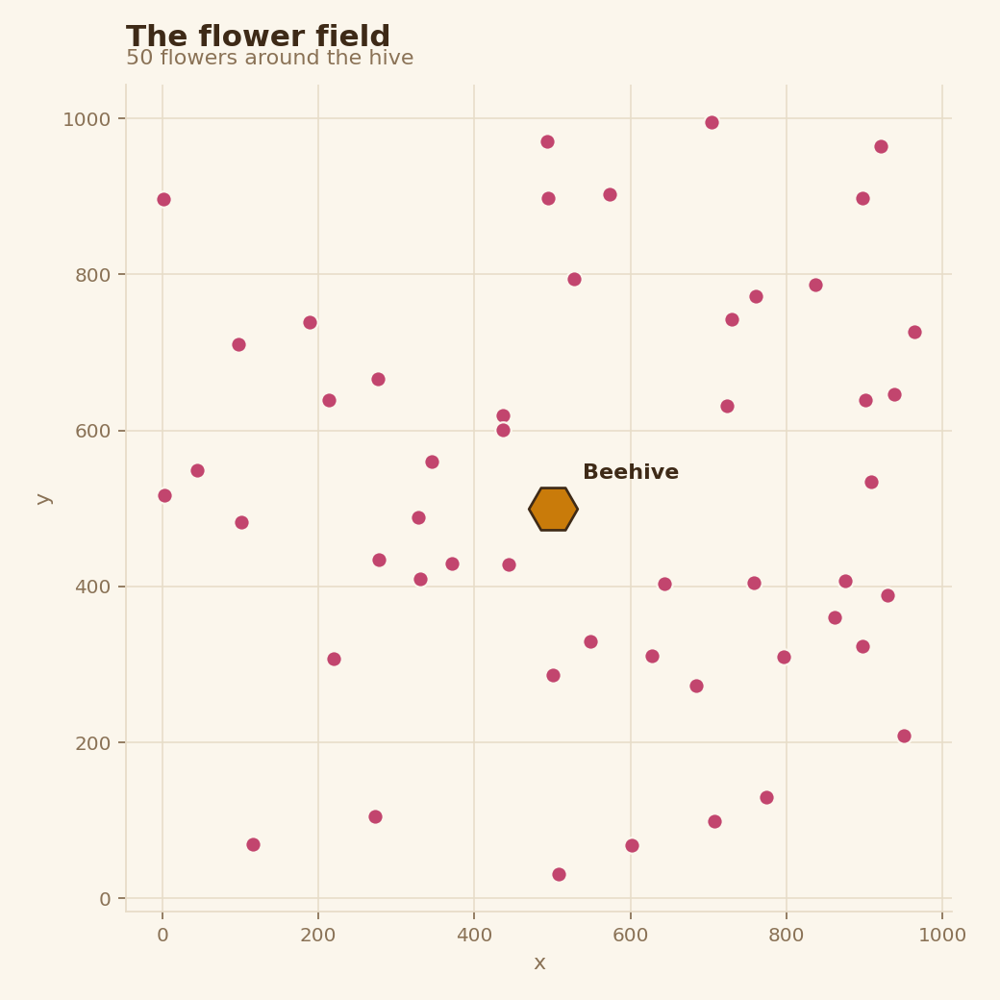
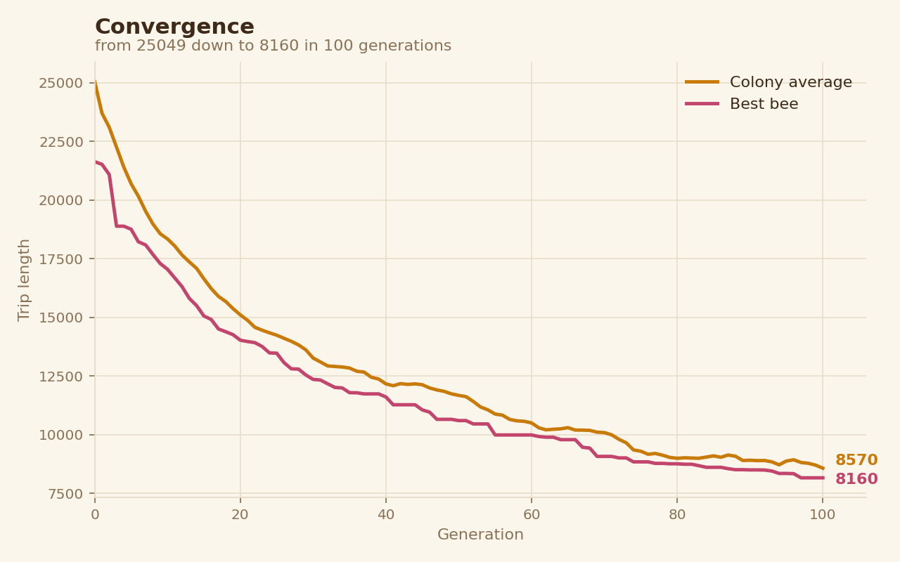
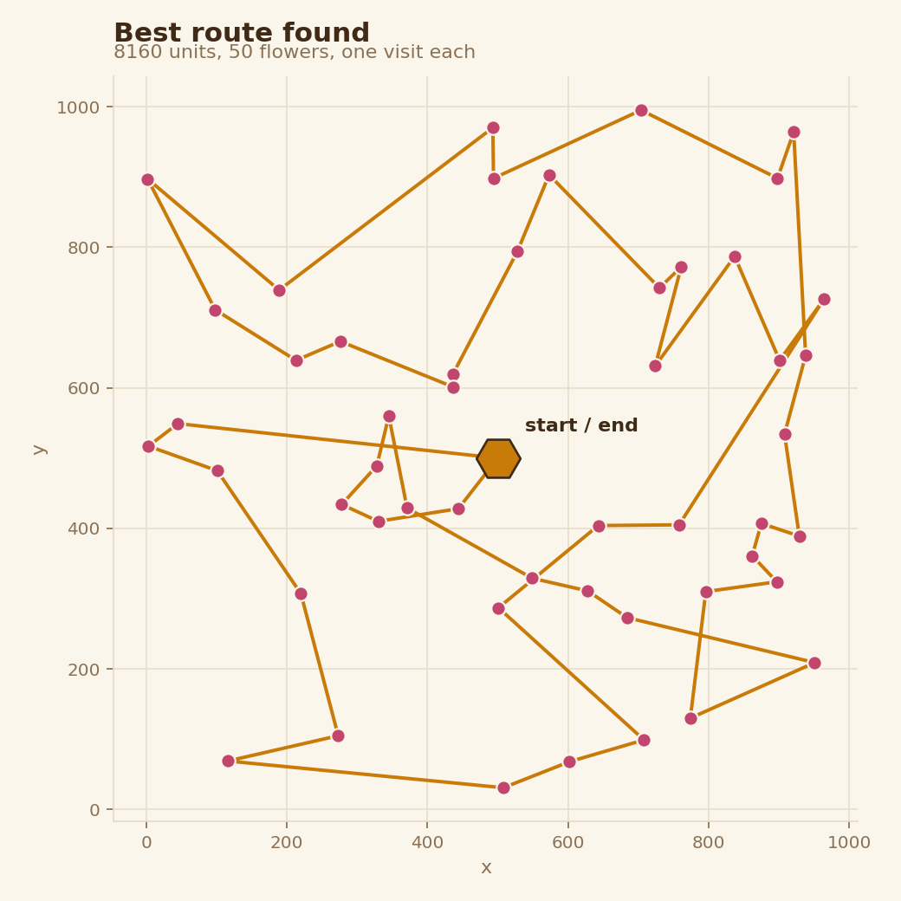
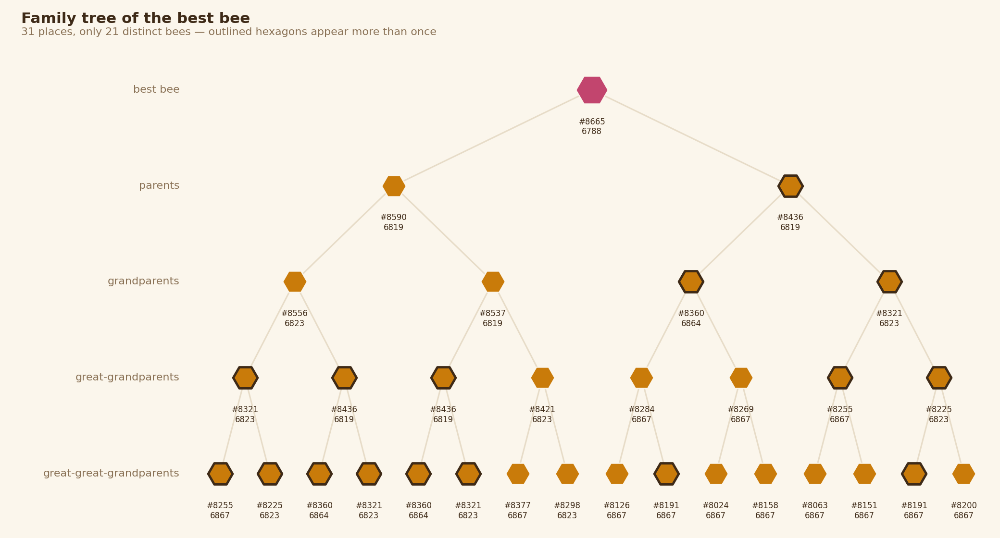

# Le miel et les abeilles

Résolution du problème du voyageur de commerce par algorithme génétique.

Projet Bachelor 2 Data & IA — La Plateforme_

## La problématique

Une colonie s'installe dans un pommier au milieu d'un champ de 50 fleurs. Chaque
abeille part de la ruche, en (500, 500), butine **toutes** les fleurs une seule
fois, puis rentre. La reine veut que sa colonie devienne, génération après
génération, la plus rapide possible.

C'est le **problème du voyageur de commerce** : trouver l'ordre de visite le
plus court. Il y a 50! ordres possibles, un nombre à 65 chiffres. Les essayer
tous est impossible, même pour un ordinateur. Il faut donc une méthode qui
trouve un **très bon** trajet sans garantir le meilleur : une heuristique.

La colonie compte 101 abeilles dont la reine. La reine ne butine pas : la
simulation fait évoluer les **100 butineuses**.

## En deux minutes, sans jargon

Un algorithme génétique, c'est la sélection naturelle appliquée à un problème.

- **Chaque abeille est un trajet** : un ordre dans lequel elle visite les
  fleurs. Au départ, les 100 abeilles partent complètement au hasard.
- **On mesure chaque abeille** : la longueur totale de son trajet. Plus c'est
  court, mieux c'est.
- **Les meilleures se reproduisent.** Une fille reprend le début du trajet de
  sa mère, puis visite les fleurs restantes dans l'ordre où son père les
  visitait. Elle hérite ainsi d'un bout du savoir de chacun.
- **Parfois, une mutation.** On retourne au hasard un morceau de son trajet.
  La plupart du temps c'est pire, mais parfois c'est un raccourci que personne
  n'avait trouvé.
- **Les plus lentes sont remplacées** par les nouvelles, et on recommence.

Personne n'explique aux abeilles comment faire un bon trajet. Mais à chaque
génération, ce qui marche se transmet et ce qui ne marche pas disparaît. En 100
générations, la distance moyenne de la colonie est divisée par 3,5.

## Lancer

```bash
uv sync
uv run python main.py     # une simulation + les quatre figures
uv run python study.py    # l'étude des paramètres (environ 2 minutes)
```

## Structure

| Fichier | Rôle |
|---|---|
| `config.py` | Tous les paramètres, au même endroit |
| `bee.py` | La classe `Bee` : un ordre de visite, sa longueur, ses parents |
| `beehive.py` | Le champ, la matrice de distances, la colonie, les opérateurs et le registre généalogique |
| `plots.py` | Les quatre figures |
| `study.py` | L'étude des paramètres |
| `main.py` | Point d'entrée |

## Le champ



## Choix d'implémentation

### La métrique de fitness

La fitness d'une abeille est la **longueur totale de son trajet**, ruche
comprise au départ et à l'arrivée. Le sujet parle de temps de parcours : à
vitesse constante, le temps est proportionnel à la distance, les deux
classements sont donc identiques. Aucune autre métrique n'aurait de sens ici,
puisque l'objectif fixé par la reine est justement de butiner le plus vite.

### Des indices, pas des coordonnées

J'ai choisi de manipuler des indices plutôt que des coordonnées parce qu'un
indice permet de lire directement dans une matrice de distances calculée une
seule fois au départ. Je ne recalcule donc jamais une distance : je la lis.

La matrice fait 51 × 51 (la ruche plus les 50 fleurs) et coûte 2 601 racines
carrées, une fois pour toutes. L'approche par coordonnées en refait 51 par
abeille et par évaluation.

Mesuré sur 9 000 évaluations, résultats identiques des deux côtés :

| Méthode | Temps |
|---|---|
| Coordonnées, une racine par segment | 0,462 s |
| Matrice pré-calculée | 0,086 s |

Soit **5,4 fois plus rapide**. L'écart est plus faible que le rapport du
nombre de racines carrées le laisserait croire, parce que le coût ne vient
pas uniquement des racines : la boucle Python et les accès mémoire pèsent
dans les deux cas.

### Un croisement qui préserve la permutation

Le croisement naïf — début de la mère, fin du père — produisait des trajets
qui visitaient deux fois la même fleur et en oubliaient d'autres : 36 fleurs
distinctes sur 50. Le danger n'est pas le plantage, c'est l'absence de
plantage — `path_length` calculait une distance parfaitement crédible pour un
trajet impossible, et rien à l'écran ne l'aurait signalé.

La version retenue garde le début de la mère, puis complète avec les fleurs
manquantes dans l'ordre où le père les visite. Vérifiée sur 2 040 croisements
couvrant toutes les positions de coupe : le résultat est toujours une
permutation valide des 50 fleurs.

### Une mutation par inversion de segment (2-opt)

Inverser un segment ne modifie que deux liaisons du trajet, là où échanger
deux fleurs en modifie quatre. La mutation conserve donc davantage de ce que
l'abeille avait déjà de bon, et a plus de chances de l'améliorer légèrement
plutôt que de le détruire.

### Sélection par tournoi et élitisme

Le tournoi tire plusieurs abeilles au hasard et garde la meilleure : il
favorise les bonnes sans exclure les autres. Les 10 meilleures passent à la
génération suivante sans modification, ce qui garantit que la meilleure
distance ne remonte jamais.

### Un registre de toutes les abeilles

Chaque abeille garde le numéro de ses deux parents. Pour pouvoir remonter
l'arbre généalogique, la ruche conserve toutes les abeilles nées, y compris
celles qui ont disparu de la colonie : 9 100 abeilles sur une simulation
complète.

## Étude des paramètres

Chaque réglage est testé sur plusieurs graines aléatoires. On compare la
moyenne des résultats, mais aussi leur **écart-type** : si deux réglages
diffèrent moins que la dispersion de leurs propres mesures, on ne peut pas
conclure qu'ils diffèrent.

### Un paramètre à la fois

5 graines. Les autres paramètres restent au réglage de départ : tournoi 3,
mutation 0,3, 10 élites.

**Taille du tournoi**

| Taille | Meilleure (moyenne) | Écart-type |
|---|---|---|
| 2 | 9 409 | 383 |
| 3 | 8 330 | 284 |
| 5 | 7 466 | 281 |
| 10 | 7 259 | 146 |
| 20 | 7 428 | 432 |

Un tournoi de 2 ne trie presque pas. L'optimum est vers 10.

**Taux de mutation**

| Taux | Meilleure (moyenne) | Écart-type |
|---|---|---|
| 0,0 | 16 724 | 541 |
| 0,1 | 9 218 | 199 |
| 0,3 | 8 330 | 284 |
| 0,5 | 8 204 | 446 |
| 0,8 | 8 834 | 437 |
| 1,0 | 9 464 | 335 |

Sans mutation, le résultat est deux fois pire : les enfants ne font que
recombiner ce qui existe déjà, la population se fige. À l'inverse, muter tout
le monde détruit à chaque génération ce que la sélection vient de trouver.

**Nombre d'élites**

| Élites | Meilleure (moyenne) | Écart-type |
|---|---|---|
| 0 | 8 350 | 143 |
| 1 | 8 423 | 536 |
| 5 | 8 257 | 370 |
| 10 | 8 330 | 284 |
| 25 | 8 394 | 369 |
| 50 | 9 424 | 820 |

Entre 0 et 25, les écarts sont plus petits que les écarts-types : **aucun effet
mesurable**. Seul 50 dégrade nettement — la moitié de la population ne change
plus, il reste moitié moins de place pour les enfants.

### Combinaisons

Tester un paramètre à la fois ne suffit pas : deux paramètres peuvent
interagir. 12 graines :

| Tournoi | Mutation | Meilleure (moyenne) | Écart-type |
|---|---|---|---|
| 3 | 0,3 | 8 092 | 423 |
| 10 | 0,5 | 7 081 | 155 |
| **20** | **0,7** | **6 750** | 276 |
| 50 | 0,9 | 6 543 | 173 |
| 100 | 0,9 | 6 462 | 141 |

Mesuré seul, un tournoi de 20 était moins bon qu'un tournoi de 10. Combiné à
une mutation plus forte, il devient meilleur : une sélection plus dure paie
quand la mutation fournit assez de diversité pour la nourrir.

### Mutation fixe ou évolutive

Tournoi 20, 12 graines. Dans les versions évolutives, le taux glisse en ligne
droite de la première valeur à la seconde au fil des 100 générations.

| Mutation | Meilleure (moyenne) | Écart-type |
|---|---|---|
| **fixe 0,7** | **6 750** | 276 |
| décroissante 0,9 → 0,3 | 7 036 | 179 |
| décroissante 1,0 → 0,2 | 6 945 | 307 |
| décroissante 0,9 → 0,5 | 6 852 | 253 |
| croissante 0,3 → 0,9 | 6 744 | 216 |

L'idée classique — muter beaucoup au début pour explorer, peu à la fin pour
affiner — **dégrade** le résultat ici. La version croissante fait jeu égal
avec la fixe : 6 écarts de distance pour plus de 200 d'écart-type, aucune
différence mesurable. La mutation reste donc fixe.

### Pourquoi ne pas prendre le meilleur chiffre

Avec un tournoi de 100 sur une population de 100, le tournoi retient toujours
la même abeille : la meilleure. La mère et le père sont donc identiques, et
croiser une abeille avec elle-même la redonne exactement (vérifié sur 200
permutations × 51 positions de coupe). **Le croisement ne fait plus rien** :
chaque enfant est un clone muté de la meilleure abeille.

Ce n'est plus un algorithme génétique mais une recherche locale. Qu'elle soit
la plus performante montre que sur ce problème, à cette taille, **l'essentiel
du travail est fait par la mutation 2-opt, pas par le croisement**. C'est aussi
ce qui explique l'échec de la mutation décroissante : réduire la mutation en
fin de course, c'est couper le moteur.

### Réglage retenu

**Tournoi 20, mutation fixe 0,7, 10 élites.** C'est le meilleur réglage qui
reste un vrai algorithme génétique — les parents sont distincts, le croisement
opère.

## Résultats

Avec le réglage retenu, `seed=0`, 100 abeilles, 100 générations :

| | Génération 0 | Génération 100 |
|---|---|---|
| Moyenne de la colonie | 25 049 | 7 210 |
| Meilleure abeille | 21 637 | 6 788 |

Une réduction de 71 % de la distance moyenne, en moins d'une seconde. Le
réglage de départ (tournoi 3, mutation 0,3) donnait 8 160.





## L'arbre généalogique



Sur quatre générations d'ancêtres, il y a 31 places mais **seulement 21
abeilles différentes**. Le père de la meilleure abeille, `#8436`, est aussi
deux fois son arrière-grand-parent. Et `#8151` a pour parents `(8063, 8063)` :
elle est née d'une abeille croisée avec elle-même.

C'est de la **consanguinité**, conséquence directe d'une sélection dure : les
meilleures se reproduisent tellement qu'elles finissent par se croiser entre
elles. Les distances le confirment : tous les ancêtres sont entre 6 788 et
6 867. La population est devenue presque homogène, et c'est pourquoi la
mutation reste indispensable jusqu'au bout.

## Autres comparaisons

Mesurées avec le réglage de départ (tournoi 3, mutation 0,3).

### Opérateur de mutation

| Mutation | Moyenne gén. 100 | Meilleure |
|---|---|---|
| Inversion de segment (2-opt) | **8 570** | **8 160** |
| Échange de deux fleurs | 10 288 | 9 839 |

16,7 % de mieux sur la moyenne, 17,1 % sur la meilleure.

### Remplacement générationnel ou steady-state

Une erreur d'indentation a produit accidentellement une variante où la
population est remplacée à chaque naissance, les nouveau-nées devenant
immédiatement parents potentiels. Elle converge mieux : 6 745 contre 8 160
pour la version générationnelle demandée par le sujet.

## Limites

Le meilleur trajet trouvé se croise encore **une fois** (compté par calcul
sur les 51 segments). Or deux segments qui se croisent peuvent toujours être
remplacés par deux segments plus courts : ce seul croisement prouve que
6 788 n'est pas l'optimum. Le réglage de départ, à 8 160, en laissait
plusieurs.

## Veille : d'autres heuristiques

- **Plus proche voisin.** La méthode la plus simple : aller toujours à la
  fleur non visitée la plus proche. Très rapide, mais elle se piège elle-même
  en fin de parcours, quand il ne reste que des fleurs éloignées.
- **Recherche locale 2-opt.** Partir d'un trajet et inverser des segments
  tant que ça raccourcit. C'est exactement notre mutation, appliquée
  systématiquement au lieu d'au hasard. Lin et Kernighan (1973) en ont fait
  une version plus puissante qui reste une référence.
- **Recuit simulé.** Comme la recherche locale, mais on accepte parfois un
  trajet plus long, avec une probabilité qui diminue au fil du temps. Cela
  permet de sortir d'un optimum local au lieu d'y rester bloqué.
- **Recherche tabou** (Glover, 1986). On interdit temporairement de revenir
  sur ses pas, pour forcer l'exploration.
- **Colonies de fourmis** (Dorigo, début des années 1990, testées d'abord sur
  le voyageur de commerce). Chaque fourmi laisse une trace de phéromone sur
  son chemin, d'autant plus forte que le chemin est court. Les suivantes
  préfèrent les traces fortes.
- **Colonies d'abeilles artificielles** (Karaboga, 2005). Inspirées du
  butinage réel : des abeilles exploitent les bonnes sources, des éclaireuses
  en cherchent de nouvelles.
- **Méthodes exactes.** La programmation dynamique de Held et Karp (1962)
  garantit l'optimum mais son coût explose avec le nombre de villes. Des
  solveurs spécialisés comme Concorde résolvent exactement des instances de
  plusieurs milliers de villes.

## Conclusion

L'algorithme génétique fait passer la colonie d'un trajet moyen de 25 049 à
7 210 en 100 générations, en moins d'une seconde.

Les comparaisons montrent trois choses. **La mutation est le moteur** :
sans elle le résultat est deux fois pire, et la réduire en cours de route le
dégrade. **La sélection et la mutation doivent être réglées ensemble** : une
sélection plus dure n'aide que si la mutation fournit assez de diversité.
Et **le croisement contribue peu sur ce problème** : poussé à l'extrême,
l'algorithme se transforme en recherche locale et fait encore mieux.

L'arbre généalogique rend cette dernière observation visible : la meilleure
abeille descend d'une lignée consanguine, dans une population devenue presque
homogène. Le croisement ne peut plus rien apporter quand tous les parents se
ressemblent ; seule la mutation continue de créer de la nouveauté.

Enfin, le trajet final se croise encore une fois : il existe un meilleur
trajet, et on sait même où chercher.